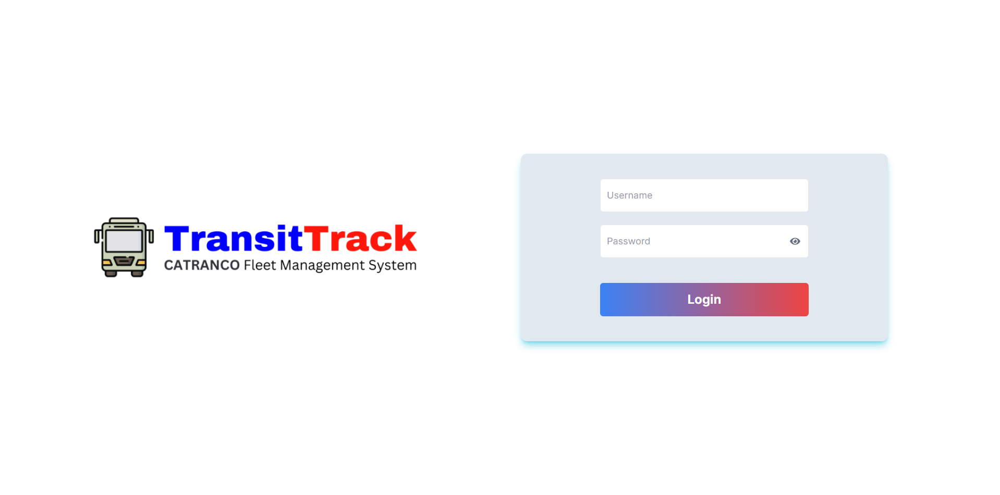
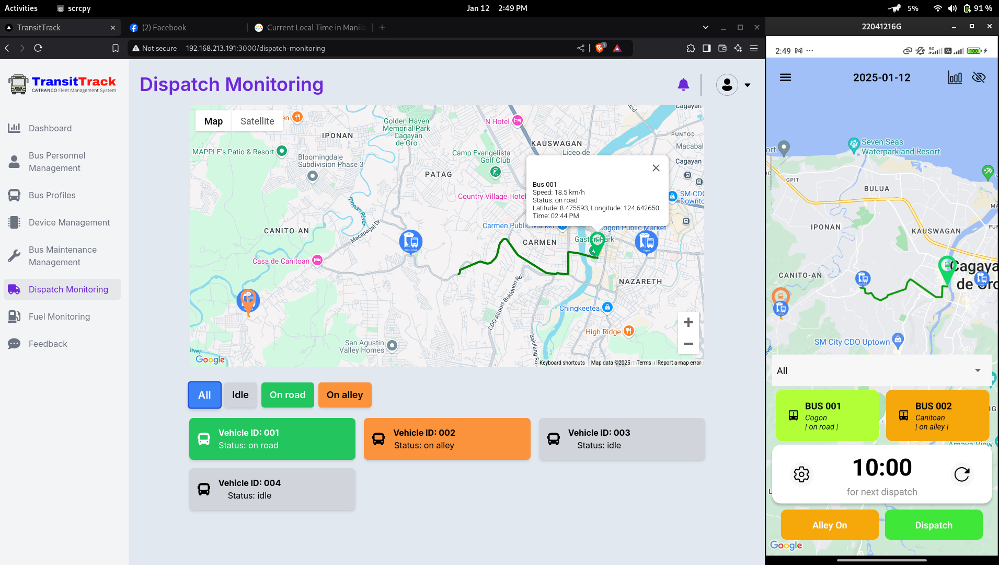

# **Welcome to TransitTrack Web Application** 👋

## **About the Application**

This app is designed for Operation Managers. It handles CRUD operations for various management tasks, including:

- Employee management
- Bus management
- Personnel management
- Device management
- Maintenance management
- Dispatch monitoring
- Fuel management
- Feedback management

**This application is built using Next.js.**

## **Application Preview**

|  |  |
|:----------------------------------------:|:----------------------------------------:|
| *Login screen of the TransitTrack Web Application.* | *Dispatch Monitoring view for Operation Managers and Dispatchers.* |

## **Getting Started**

Follow these steps to set up and run the Next.js web application:

### **Prerequisites**

- Ensure you have Node.js and npm installed on your machine.
- Install an IDE like Visual Studio Code.

### **Setup Instructions**

1. **Open Terminal or Command Prompt**

   - Navigate to the project directory:
     ```sh
     cd CATRANCO-FMS-Web
     ```

2. **Open the Project in Your IDE**

   - Use the following command to open the project in Visual Studio Code:
     ```sh
     code .
     ```

3. **Install Dependencies**

   - Run the following command to install all necessary dependencies:
     ```sh
     npm install
     ```

4. **Download Environment File**

   - Download the example `.env.local` file from [this link](https://drive.google.com/file/d/1E3fMmSvLRHIEaMj0eKpVyGviPXqnoY3C/view?usp=sharing).

5. **Configure IP Address**

   - Find your computer's IP address and edit the `package.json` and `.env.local` files with this IP address. This allows the frontend to communicate with the backend without deploying to a server.

   Example configuration:
   ```
   NEXT_PUBLIC_API_BASE_URL=http://192.168.70.191:8000/api
   NEXT_PUBLIC_STORAGE_URL=http://192.168.70.191:8000/storage
   ```

   In the `package.json` file, update the following:
   ```json
   "dev": "next dev --hostname 192.168.70.191 --port 3000",
   ```

6. **Add API Keys**

   - Add the [Pusher](https://pusher.com/), [Flespi](https://flespi.io/), and [Google API](https://console.developers.google.com/) keys in the `.env.local` file.

7. **Run the Application**

   - Start the development server:
     ```sh
     npm run dev
     ```

## **Additional Resources**

- For further assistance, refer to the official Next.js documentation or reach out to the project maintainers.
